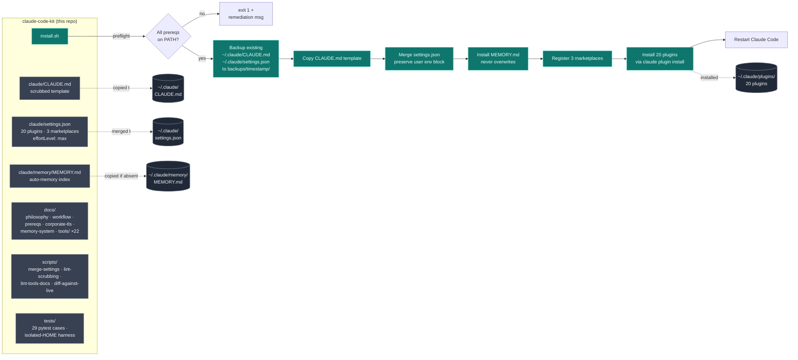

# claude-code-kit

Opinionated bootstrap kit for replicating a complete, evidence-first Claude
Code development environment on a clean macOS or Linux machine.

The kit ships three things together so a new machine reaches a working,
high-discipline setup with a single command:

1. **A scrubbed global `CLAUDE.md`** that encodes the workflow philosophy
   (TDD-first, evidence-before-assertions, mandatory code-search order, Berry
   verification as a hard gate, spec-driven development as an optional layer).
2. **A merged `settings.json`** that enables 20 curated plugins from 3
   marketplaces and sets `effortLevel: max` — without overwriting your
   existing `env` block.
3. **A complete documentation layer** explaining *why* every plugin, MCP,
   skill, and rule is in the kit, plus the workflow the kit assumes you want
   to adopt.

> This is datastealth's productivity kit. It is
> opinionated by design — adopting it means adopting the workflow, not just
> the file list. If you only want a subset, fork it and trim.

---

## Architecture



`install.sh` is the only entry point. It is idempotent (re-runnable),
reversible (`uninstall.sh` restores from the timestamped backup), and
strictly local — it does not touch anything outside `~/.claude/`.

---

## The agentic development process this kit enforces

Once the kit is installed and Claude Code is restarted, every non-trivial
task routes through the workflow below. Berry verification gates are
mandatory at three points (plan, complete, intent-change); spec-kit is
an optional alternative spec-driven layer for higher-ceremony work.


Three load-bearing rules behind the diagram:

- **Evidence before assertions.** No claim ships without a Berry span citing
  the evidence. Test output is always captured as a span via
  `berry-search-and-learn` before any "tests pass" claim.
- **Update spec FIRST, then implementation.** In spec-driven mode, if the
  user changes their mind mid-flight, the spec gets updated first and
  `/speckit-analyze` re-runs to surface what else needs to change. Never
  silently let the implementation drift from the spec.
- **3-strike rule.** If a Berry audit fails three times on the same claim
  set, STOP and surface the partial results. Do not silently loop.

See `docs/workflow.md` for the full 10-step procedure, `docs/philosophy.md`
for the reasoning, and `claude/CLAUDE.md` for the exact rules Claude reads
every session.

---

## What you get

| Layer | Contents |
|---|---|
| **Workflow** | `CLAUDE.md` (~210 lines) enforcing TDD-first, evidence-before-assertions, the MANDATORY code-search order (`graph_continue` → LSP → Read/Grep — bash grep/find/cat/sed/awk forbidden), Berry as a hard gate, and the optional spec-kit layer with a 9-step agent playbook. |
| **Plugins (20)** | 18 from `anthropics/claude-plugins-official`: superpowers, feature-dev, berry-adjacent-rules, code-simplifier, context7, claude-md-management, frontend-design, explanatory-output-style, notion, gopls-lsp, typescript-lsp, **jdtls-lsp** (Java), playwright, chrome-devtools-mcp, microsoft-docs, huggingface-skills, security-guidance, optibot, remember. 1 from `leochlon/hallbayes`: berry (evidence verifier). 1 from `multica-ai/andrej-karpathy-skills`. |
| **Berry verifier** | Defaults to OpenRouter `openai/gpt-4o-mini` (configured via `~/.berry/config.json` + `~/.berry/mcp_env.json`); self-hosted `llama.cpp` remains supported as the offline alternative. |
| **Memory system** | `MEMORY.md` index template at `~/.claude/memory/`, plus `docs/memory-system.md` explaining the 4 memory types (user, feedback, project, reference), the index format, and the 200-line cap. |
| **Per-tool rationale** | 22 markdown files under `docs/tools/` (one per plugin / MCP / skill / external dependency) following a strict 5-section schema enforced by `scripts/lint-tools-docs.py`. |
| **Settings** | `effortLevel: max` merged in; your existing `env` block (including any corporate-CA bundle vars) preserved byte-for-byte. |

---

## Quick install

```bash
gh repo clone dthanos-datastealth/claude-code-kit
cd claude-code-kit
./install.sh
```

Then restart Claude Code. Verify with `claude plugin list` — you should
see all 20 plugins.

For corporate networks with TLS interception, see
[`docs/corporate-tls.md`](docs/corporate-tls.md) before running install.

---

## Prereqs

Required on `$PATH` before `install.sh` will run:

| Tool | Why |
|---|---|
| `claude` | Claude Code CLI |
| `git` | Source control |
| `gh` | GitHub auth (must be `gh auth login`-ed) |
| `python3` ≥ 3.11 | Used by `merge-settings.py` and tests |
| `uv` | Tool installer for `specify` (spec-kit) and Berry's MCP launcher |

The installer **does not** install these for you — see
[`docs/prereqs.md`](docs/prereqs.md) for install commands per OS plus
optional tools (LSP binaries, `ripgrep`, `jq`, `shellcheck`, `specify`).

---

## What install.sh does (and does not do)

**Does, in order, idempotently:**

1. Preflight-check required tools on `$PATH`. Exits with remediation if any
   are missing.
2. Back up existing `~/.claude/CLAUDE.md` and `~/.claude/settings.json` to
   `~/.claude/backups/<ISO-timestamp>/`.
3. Copy `claude/CLAUDE.md` to `~/.claude/CLAUDE.md`.
4. Merge `claude/settings.json` into `~/.claude/settings.json` —
   `enabledPlugins`, `extraKnownMarketplaces`, and `effortLevel` are
   replaced from the kit; your `env` block is preserved byte-for-byte.
5. Install `claude/memory/MEMORY.md` at `~/.claude/memory/MEMORY.md` only
   if you don't already have one. Never overwrites.
6. Register the three plugin marketplaces (with one retry on network blip).
7. Install all 20 plugins (with one retry per plugin on failure).
8. Print next steps.

**Does NOT:**

- Install `uv`, `gh`, `ripgrep`, `jq`, LSP server binaries (`gopls`,
  `typescript-language-server`, `jdtls`), MCP backend binaries, the
  `specify` CLI, or the Berry verifier backend.
- Touch corporate CA certificate configuration. Your `NODE_EXTRA_CA_CERTS`
  or `SSL_CERT_FILE` env vars (if any) survive the merge untouched.
- Modify your shell rc files (`.zshrc`, `.bashrc`).
- Write to any path outside `~/.claude/`.

---

## What to do after `install.sh`

| Step | Why | Command |
|---|---|---|
| Restart Claude Code | New plugins/skills register at session start | `Cmd-Q` then relaunch, or `/exit` then `claude` |
| (Optional) Configure Berry verifier | Berry calls fail closed without a reachable LLM backend | `/berry:berry-configure` — sets up the OpenRouter or self-hosted backend |
| (Optional, per project) Enable spec-kit | Adds `/speckit-*` slash commands to that project | `cd <your-project> && specify init --here --integration claude` |
| (Optional) Install LSP binaries | Without these, the LSP plugins have nothing to call | `go install golang.org/x/tools/gopls@latest`, `npm i -g typescript typescript-language-server`, `brew install jdtls` (or distribution equivalents) |
| (Optional) Install dual-graph MCP | The CLAUDE.md mandates `graph_continue` first for code search; install per upstream docs then `claude mcp add` | See upstream docs |

The kit deliberately keeps these optional / per-developer rather than
bundling them in `install.sh` — see [`docs/philosophy.md`](docs/philosophy.md)
for the reasoning (foundational tools have their own update cadence and
security posture; bundling them creates supply-chain risk and version-pin
headaches).

---

## Reverting

```bash
./uninstall.sh
```

Restores `~/.claude/CLAUDE.md` and `~/.claude/settings.json` from the most
recent timestamped backup under `~/.claude/backups/`. Idempotent — safe to
re-run. Plugins remain installed (use `claude plugin uninstall <name>` if
you also want to remove those).

---

## Drift detection

Once you've adopted the kit, your live `~/.claude/` will inevitably drift
from this repo — you'll add a plugin, tweak a rule, etc. Run:

```bash
./scripts/diff-against-live.sh
```

This compares `claude/CLAUDE.md` against `~/.claude/CLAUDE.md` (unified
diff) and shows a structural delta on `settings.json` (added/removed
plugins, added marketplaces, env-key changes). Exits 0 on no drift, 1 on
any drift. Use it to decide what to PR back into the kit.

---

## Layout

```
claude-code-kit/
├── README.md                          (this file)
├── LICENSE                            MIT
├── CHANGELOG.md                       Keep a Changelog format
├── CONTRIBUTING.md                    PR workflow
├── install.sh                         Bootstrap entry point
├── uninstall.sh                       Restore from latest backup
├── pyproject.toml                     pytest config
├── .github/workflows/ci.yml           shellcheck + lints + 29 pytest cases
├── claude/                            Files copied/merged into ~/.claude/
│   ├── CLAUDE.md                      Scrubbed opinionated template
│   ├── settings.json                  20 plugins, 3 marketplaces, effortLevel: max
│   └── memory/MEMORY.md               Empty index with type sections
├── docs/
│   ├── philosophy.md                  Why each rule exists
│   ├── workflow.md                    The 10-step development loop
│   ├── prereqs.md                     Install steps per OS
│   ├── corporate-tls.md               CA bundle setup for intercepted networks
│   ├── memory-system.md               Auto-memory schema and conventions
│   └── tools/                         22 per-tool rationale docs (5-section schema)
│       ├── superpowers.md             Workflow-discipline skills
│       ├── berry.md                   Evidence verifier (OpenRouter default)
│       ├── feature-dev.md             7-phase feature workflow
│       ├── dual-graph-mcp.md          Code-navigation MCP (external prereq)
│       ├── spec-kit.md                Spec-driven development CLI (optional)
│       ├── jdtls-lsp.md               Java language server
│       ├── lsp-gopls.md               Go language server
│       ├── lsp-typescript.md          TypeScript language server
│       ├── playwright-mcp.md          Browser automation
│       ├── chrome-devtools-mcp.md     CDP-level introspection
│       ├── context7.md                Live library documentation
│       ├── microsoft-docs.md          Microsoft Learn search
│       ├── notion.md                  Workspace + task tracker
│       ├── huggingface-skills.md      HF Hub workflows
│       ├── frontend-design.md         Distinctive UI generation
│       ├── code-simplifier.md         Post-implementation cleanup
│       ├── claude-md-management.md    CLAUDE.md auditing
│       ├── security-guidance.md       OWASP-aware code review
│       ├── optibot.md                 Performance-focused review
│       ├── remember.md                Session-state checkpointing
│       ├── andrej-karpathy-skills.md  LLM coding heuristics
│       └── explanatory-output-style.md Insight blocks after code
├── scripts/
│   ├── merge-settings.py              Atomic settings.json merge
│   ├── diff-against-live.sh           Drift detector
│   ├── diff-settings.py               Settings delta (JSON)
│   ├── lint-scrubbing.py              Catches owner paths / company names
│   └── lint-tools-docs.py             Enforces 5-section schema
└── tests/                             pytest with isolated-HOME harness
```

---

## Further reading

- [`docs/philosophy.md`](docs/philosophy.md) — the "why" behind every rule
- [`docs/workflow.md`](docs/workflow.md) — the 10-step development loop
- [`docs/tools/`](docs/tools/) — one rationale doc per tool
- [`CHANGELOG.md`](CHANGELOG.md) — change history
- [`CONTRIBUTING.md`](CONTRIBUTING.md) — PR workflow

## License

MIT — see [`LICENSE`](LICENSE).
