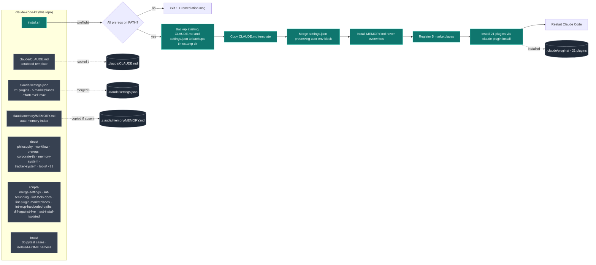
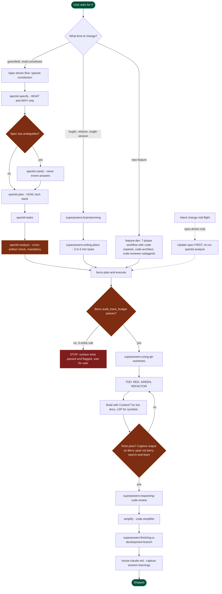
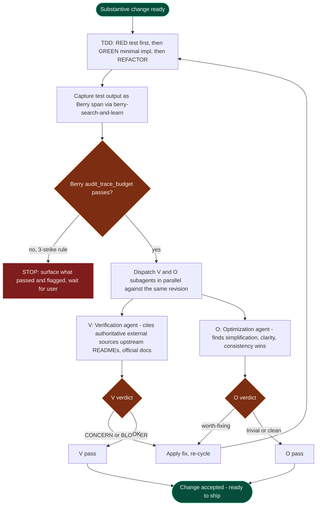

# claude-code-kit

Opinionated bootstrap kit for creating a complete, evidence-first Claude
Code agentic development engineering environment on a clean macOS or Linux machine.

The kit ships three things together so a new machine reaches a working,
high-discipline setup with a single command:

1. **A scrubbed global `CLAUDE.md`** that encodes the workflow philosophy
   (TDD-first, evidence-before-assertions, mandatory code-search order, Berry
   verification as a hard gate, spec-driven development as an optional layer).
2. **A merged `settings.json`** that enables 21 curated plugins from 5
   marketplaces and sets `effortLevel: max` — without overwriting your
   existing `env` block.
3. **A complete documentation layer** explaining *why* every plugin, MCP,
   skill, and rule is in the kit, plus the workflow the kit assumes you want
   to adopt.

> This is datastealth's productivity kit. It is
> opinionated by design — adopting it means adopting the workflow, not just
> the file list. If you only want a subset, fork it and trim.

---

## Architecture



`install.sh` is the only entry point. It is idempotent (re-runnable),
reversible (`uninstall.sh` restores from the timestamped backup), and
strictly local — it does not touch anything outside `~/.claude/`.

---

## The agentic development process this kit enforces

Once the kit is installed and Claude Code is restarted, every non-trivial
task routes through the workflow below. Berry verification gates are
mandatory at three points (plan, complete, intent-change); spec-kit is
an optional alternative spec-driven layer for higher-ceremony work.



Three load-bearing rules behind the diagram:

- **Evidence before assertions.** No claim ships without a Berry span citing
  the evidence. Test output is always captured as a span via
  `berry-search-and-learn` before any "tests pass" claim.
- **Update spec FIRST, then implementation.** In spec-driven mode, if the
  user changes their mind mid-flight, the spec gets updated first and
  `/speckit-analyze` re-runs to surface what else needs to change. Never
  silently let the implementation drift from the spec.
- **3-strike rule.** If a Berry audit fails three times on the same claim
  set, STOP and surface the partial results. Do not silently loop.

See `docs/workflow.md` for the full 10-step procedure, `docs/philosophy.md`
for the reasoning, and `claude/CLAUDE.md` for the exact rules Claude reads
every session.

---

## The MANDATORY Quality Loop (TDD → Berry → V+O)

The workflow diagram above shows *which steps run*. The quality loop
diagram below shows the *unconditional discipline that wraps every
substantive change*, regardless of which workflow framed it. The
kit's `claude/CLAUDE.md` codifies this as a top-level MANDATORY
section so every session reads it before the plugin tour.



Three layers, all mandatory:

- **TDD discipline.** Write the failing test first; confirm it fails
  for the right reason (not from missing imports or fixture gaps).
  Implement the minimum that turns it green. REFACTOR only with the
  test green. **Lifecycle tests, not just function-centric ones** —
  for anything stateful (sessions, caches, queues, write paths),
  assert on the full create → use → close → reopen → cleanup cycle.
- **Berry verification.** Every completion claim ("tests pass", "the
  bug is fixed", "the spec is complete") must be backed by a Berry
  span citing the actual evidence. Test output is the canonical
  evidence form: capture it via `berry-search-and-learn` and cite it
  before any "tests pass" assertion. The kit's Berry plugin enforces
  this with `audit_trace_budget` as the gate — see
  [`docs/tools/berry.md`](docs/tools/berry.md).
- **V+O loop.** After any code, doc, or config change with behavioral
  impact, dispatch a **Verification agent** (cites authoritative
  external sources — upstream READMEs, official docs, vendor API
  references; output: `[OK]` / `[CONCERN]` / `[BLOCKER]`) and an
  **Optimization agent** (finds simplification, clarity, and
  consistency wins; output: `[trivial]` / `[worth-considering]` /
  `[worth-fixing]`) in parallel against the same revision. Verdicts
  of either block "done" — `[CONCERN]` / `[BLOCKER]` requires a
  correctness fix; `[worth-fixing]` requires a follow-up commit
  before the next substantive change.

Hard prohibitions: no "tests pass" claim without a Berry span;
no skipping V+O on the grounds that "the change is small" (small
changes are exactly where unaudited drift accumulates); no inventing
answers when V flags a concern; if Berry audits fail three times on
the same claim set, STOP and surface partial results.

The kit's `requesting-code-review`, `code-quality-reviewer`, and
`code-simplifier` plugins implement V- and O-style passes inside
`superpowers:subagent-driven-development`. The V+O loop above sits
**on top** of that, with one explicit difference: V+O verifies
against **external authoritative sources**, not just against the
local spec or the diff.

---

## What you get

| Layer | Contents |
|---|---|
| **Workflow** | `CLAUDE.md` (~210 lines) enforcing TDD-first, evidence-before-assertions, the MANDATORY code-search order (`graph_continue` → LSP → Read/Grep — bash grep/find/cat/sed/awk forbidden), Berry as a hard gate, and the optional spec-kit layer with a 9-step agent playbook. |
| **Plugins (21)** | 17 from `anthropics/claude-plugins-official`: superpowers, feature-dev, code-simplifier, context7, claude-md-management, frontend-design, explanatory-output-style, notion, gopls-lsp, typescript-lsp, **jdtls-lsp** (Java), playwright, chrome-devtools-mcp, microsoft-docs, huggingface-skills, security-guidance, remember. 1 from `Optimal-AI/optibot-skill`: optibot (performance review). 1 from `dthanos-datastealth/hallbayes`: berry (evidence verifier; this is a Claude-Code-packaged fork of upstream `leochlon/hallbayes`). 1 from `multica-ai/andrej-karpathy-skills`. 1 from `JuliusBrussee/caveman`: caveman (token-savings terse-output mode). |
| **Berry verifier** | Defaults to OpenRouter `openai/gpt-4o-mini` (configured via `~/.berry/config.json` + `~/.berry/mcp_env.json`); self-hosted `llama.cpp` remains supported as the offline alternative. |
| **Memory system** | `MEMORY.md` index template at `~/.claude/memory/`, plus `docs/memory-system.md` explaining the 4 memory types (user, feedback, project, reference), the index format, and the 200-line cap. |
| **Tracker discipline** | The kit's quality loop runs on a coupled `Task` tool + `docs/TRACKER.md` substrate: agents claim work, surface findings as new tasks, and update `docs/TRACKER.md` in lockstep so any human reads one file to see full multi-iteration state. `claude/CLAUDE.md` ships the Phase Start Protocol (EnterPlanMode → approval → execute), Pre-Dispatch Protocol (coordinator creates Dev + V + O tasks upfront), Verification Agent Protocol (steps A–G including hot-path `[WIRE-PATH MISS]` check), and Optimization Agent Protocol (dual-graph + LSP redundancy check). `docs/tracker-system.md` is the full schema + examples. |
| **Per-tool rationale** | 23 markdown files under `docs/tools/` (one per plugin / MCP / skill / external dependency) following a strict 5-section schema enforced by `scripts/lint-tools-docs.py`. |
| **Settings** | `effortLevel: max` merged in; your existing `env` block (including any corporate-CA bundle vars) preserved byte-for-byte. |

---

## Quick install

```bash
gh repo clone dthanos-datastealth/claude-code-kit
cd claude-code-kit
./install.sh
```

Then restart Claude Code. Verify with `claude plugin list` — you should
see all 21 plugins.

For corporate networks with TLS interception, see
[`docs/corporate-tls.md`](docs/corporate-tls.md) before running install.

---

## Prereqs

Required on `$PATH` before `install.sh` will run:

| Tool | Why |
|---|---|
| `claude` | Claude Code CLI |
| `git` | Source control |
| `gh` | GitHub auth (must be `gh auth login`-ed) |
| `python3` ≥ 3.11 | Used by `merge-settings.py` and tests |
| `uv` | Tool installer for `specify` (spec-kit) and Berry's MCP launcher |

The installer **does not** install these for you — see
[`docs/prereqs.md`](docs/prereqs.md) for install commands per OS plus
optional tools (LSP binaries, `ripgrep`, `jq`, `shellcheck`, `specify`).

---

## What install.sh does (and does not do)

**Does, in order, idempotently:**

1. Preflight-check required tools on `$PATH`. Exits with remediation if any
   are missing.
2. Back up existing `~/.claude/CLAUDE.md` and `~/.claude/settings.json` to
   `~/.claude/backups/<ISO-timestamp>/`.
3. Copy `claude/CLAUDE.md` to `~/.claude/CLAUDE.md`.
4. Merge `claude/settings.json` into `~/.claude/settings.json` —
   `enabledPlugins`, `extraKnownMarketplaces`, and `effortLevel` are
   replaced from the kit. For the `env` block, **the kit's defaults are
   layered UNDER your existing env entries** (your entries always win on
   conflict). See "Corporate TLS handling" below for the one kit default
   that ships today and why.
5. Install `claude/memory/MEMORY.md` at `~/.claude/memory/MEMORY.md` only
   if you don't already have one. Never overwrites.
6. Register the five plugin marketplaces (with one retry on network blip).
7. Install all 21 plugins (with one retry per plugin on failure).
8. Print next steps.

**Does NOT:**

- Install `uv`, `gh`, `ripgrep`, `jq`, LSP server binaries (`gopls`,
  `typescript-language-server`, `jdtls`), MCP backend binaries, the
  `specify` CLI, or the Berry verifier backend.
- Modify your shell rc files (`.zshrc`, `.bashrc`).
- Write to any path outside `~/.claude/`.

---

## Corporate TLS handling (the kit's one env default)

If your laptop sits behind a corporate TLS-intercepting proxy
(Zscaler, Netskope, Palo Alto Prisma, Cisco Umbrella, etc.), some
of the kit's plugins fail to start out of the box because they fetch
upstream dependencies that get TLS-rejected by the bundled cert
stores in `uvx` / Node / Python `requests`. The most visible
example is the Berry plugin: `uvx` tries to download `openai` from
PyPI to satisfy Berry's dependencies, the corporate proxy presents
its own cert, `uvx`'s bundled rustls trust store doesn't have the
corporate CA, and the plugin shows up as `✘ failed` in `claude mcp list`.

The kit handles this by shipping **one env default**:

```jsonc
// claude/settings.json
{
  "env": {
    "UV_NATIVE_TLS": "1"
  }
}
```

`UV_NATIVE_TLS=1` tells `uvx` to use the operating system's native
TLS stack instead of its bundled rustls certs. On macOS that's the
Keychain; on Linux that's the system CA bundle (`/etc/ssl/certs/...`).
**If your corporate cert is installed in the system trust store**
(which is the standard way corporate IT distributes it), `uvx` will
trust it through this env var alone — no per-machine path needed.

**The merge is layered:** when `install.sh` runs, the kit's
`UV_NATIVE_TLS=1` is added to your `~/.claude/settings.json` env
block **only if you don't already have an entry for it**. Any env
entry you already have always wins. You can disable the default
explicitly by setting `UV_NATIVE_TLS` to a different value (e.g.
`"0"`) in your own settings.json — the merge respects that.

**If the system trust store isn't enough** (e.g. your corporate
cert is only available as a file, not installed in Keychain), see
[`docs/corporate-tls.md`](docs/corporate-tls.md) for the
`SSL_CERT_FILE` / `REQUESTS_CA_BUNDLE` / `NODE_EXTRA_CA_CERTS` /
`GIT_SSL_CAINFO` env vars you set yourself. The kit deliberately
does NOT bake an absolute cert path into any plugin's config (that
would couple the kit to one specific machine's filesystem); supplying
the path is the user's responsibility.

**The kit does NOT:**
- Bake any absolute corporate-CA cert path into a plugin's `.mcp.json`
  (a `scripts/lint-mcp-hardcoded-paths.py` guard runs on every
  `test-install-isolated.sh` to catch regressions).
- Install a corporate CA bundle on your behalf.

---

## Required setup after `install.sh`

`install.sh` only configures Claude Code and installs plugins. The kit's
CLAUDE.md mandates that several **external** tools are present —
without them the discipline the kit enforces is non-functional. These
steps are **required**, not optional. The reason `install.sh` does not
run them itself is supply-chain risk: each foundational tool below has
its own update cadence, signing keys, and security posture, and
bundling them into a config bootstrap is the wrong place to take that
responsibility. See [`docs/philosophy.md`](docs/philosophy.md).

### One-time, on every machine (do these in order, immediately after `install.sh`)

| Step | Why | Command |
|---|---|---|
| **1. Restart Claude Code** | New plugins/skills register at session start | `Cmd-Q` then relaunch, or `/exit` then `claude` |
| **2. Configure the Berry verifier backend** | Berry verification is a MANDATORY gate per CLAUDE.md; every Berry call fails closed without a reachable LLM backend | `/berry:berry-configure` — walks you through OpenRouter (default — `openai/gpt-4o-mini`) or a self-hosted llama.cpp endpoint |
| **3. Install the dual-graph MCP** | CLAUDE.md's MANDATORY code-search order requires `graph_continue` as the FIRST call for every code lookup; without it the kit falls back to bash grep which the kit's hard rules forbid | Follow upstream dual-graph MCP install instructions, then `claude mcp add <name> <command>` to register it locally |
| **4a. Install the Go LSP binary (`gopls`)** | The kit's `gopls-lsp` plugin is an MCP wrapper; it does not auto-install the language server. Without `gopls` on `$PATH`, the Go LSP integration loads but every call falls through | `go install golang.org/x/tools/gopls@latest` (Go must be installed; see [`docs/prereqs.md`](docs/prereqs.md) section 7). Ensure `$(go env GOPATH)/bin` is on `$PATH`. |
| **4b. Install the TypeScript LSP binaries** | Same reason as 4a — `typescript-lsp` is a plugin wrapper; the actual language server is a separate npm package | `npm install -g typescript typescript-language-server` (Node 18+; see [`docs/prereqs.md`](docs/prereqs.md) section 8). |
| **4c. Install the Java LSP binary (`jdtls`) + JDK 21+** | Same reason as 4a — `jdtls-lsp` is a plugin wrapper; the underlying Eclipse JDT.LS server requires Java 21+ at runtime | macOS: `brew install jdtls` (Homebrew pulls a current JDK as a dependency; pin with `brew install openjdk@21 jdtls` only if you need that specific JDK on PATH). Linux: install OpenJDK 21+ via your package manager + download `jdtls` from the [official release page](https://download.eclipse.org/jdtls/snapshots/?d). See [`docs/prereqs.md`](docs/prereqs.md) section 9. |

### Per project, when starting work on a new repo

| Step | Why | Command |
|---|---|---|
| **6. Initialize spec-kit for the project** | Required when adopting the spec-driven flow for a project; installs `/speckit-*` skills + `.specify/` scaffold into the project | `cd <your-project>` then `specify init --here --integration claude`, then restart Claude Code in that directory |

### Per session (caveman is the only opt-in here)

The caveman plugin is installed automatically by `install.sh` (it ships
as `caveman@caveman` via the `JuliusBrussee/caveman` marketplace). What
*is* per-session is the activation: invoke the plugin's slash command
when output-token volume is the constraint, then it's active for the
rest of that session. All other plugins/skills are session-scope
automatic. See [`docs/tools/caveman.md`](docs/tools/caveman.md) for
mode flags (`lite`, `full`, `ultra`, `wenyan`).

### Verifying everything is wired up

After steps 1–4, run:

```bash
claude plugin list                              # should show 21 plugins enabled (incl. caveman@caveman)
which gopls typescript-language-server jdtls    # all three resolve
jdtls --help                                    # JVM mismatch surfaces here if any
```

Then in a fresh Claude Code session, invoke `/berry:berry-configure`
and confirm it reports the backend as reachable. If any of the above
fails, see [`docs/prereqs.md`](docs/prereqs.md) for the
section-by-section install commands.

### If npx-based MCPs show ✘ failed on first launch, restart once

`install.sh` pre-warms the npm cache for the three npx-based MCP
servers (`@playwright/mcp`, `chrome-devtools-mcp`,
`@upstash/context7-mcp`) so that first launch reads from cache
instead of resolving from the registry. Even so, on a cold install
the first Claude Code session can race the MCP handshake timeout
while `npx` is finalizing its resolve, and one or more of those three
MCPs will get marked `✘ failed` in that session. Claude Code does
**not** auto-retry an MCP once it's marked failed — the only recovery
is a session restart. Quit (`Cmd-Q` or `/exit`) and relaunch
`claude`; the cache is warm by then and all three will come up
`✓ Connected`. If a restart doesn't fix it, then it's a real
failure — check `claude mcp list` for the actual error.

---

## Reverting

```bash
./uninstall.sh
```

Restores `~/.claude/CLAUDE.md` and `~/.claude/settings.json` from the most
recent timestamped backup under `~/.claude/backups/`. Idempotent — safe to
re-run. Plugins remain installed (use `claude plugin uninstall <name>` if
you also want to remove those).

---

## Drift detection

Once you've adopted the kit, your live `~/.claude/` will inevitably drift
from this repo — you'll add a plugin, tweak a rule, etc. Run:

```bash
./scripts/diff-against-live.sh
```

This compares `claude/CLAUDE.md` against `~/.claude/CLAUDE.md` (unified
diff) and shows a structural delta on `settings.json` (added/removed
plugins, added marketplaces, env-key changes). Exits 0 on no drift, 1 on
any drift. Use it to decide what to PR back into the kit.

---

## Testing the kit in parallel (without clobbering your real `~/.claude/`)

The kit ships an isolation helper that runs `install.sh` against a
temporary `$HOME`, exercises the **real** `claude` CLI (so real plugin
installs happen), and then *proves* your real `~/.claude/` is untouched
by comparing mtimes of `~/.claude/CLAUDE.md` and `~/.claude/settings.json`
before and after.

```bash
# Keep the tempdir for inspection (default)
./scripts/test-install-isolated.sh

# Or auto-clean on success
./scripts/test-install-isolated.sh --clean
```

**What it does:**

1. Captures `mtime` of your real `~/.claude/CLAUDE.md` and `~/.claude/settings.json`.
2. Creates `$(mktemp -d -t cck-test-XXXXXX)` and runs `HOME="$TEST_HOME" ./install.sh`.
3. Asserts every expected artifact landed in the isolated HOME
   (`CLAUDE.md`, `settings.json`, `memory/MEMORY.md`, `docs/tools/`,
   the expected plugin count, and the expected per-tool docs count).
   Also runs `lint-mcp-hardcoded-paths.py` against the populated
   plugin cache — fails the test if any installed plugin's `.mcp.json`
   contains an owner-specific absolute path (`/Users/<x>`, `/home/<x>`,
   etc.) that would break the plugin on other users' machines.
4. **Leak check** — re-captures the real `~/.claude/CLAUDE.md`,
   `~/.claude/settings.json`, and `~/.claude.json` (MCP server config,
   sibling dot-file) mtimes and exits non-zero if any of the three
   changed. If a future kit change accidentally writes outside the
   isolated HOME, this catches it.
5. Prints a summary and tells you how to poke around the tempdir (or
   cleans it up if you passed `--clean`).

**What it can't isolate** (these are global by design and the kit doesn't
clone them either): the `claude` CLI binary itself, LSP server binaries
(`gopls`, `tsserver`, `jdtls`), and `gh`'s auth token. The test uses
those globals, which is what you want — you're testing the *kit* against
the real toolchain.

Use this any time you've changed `install.sh`, the plugin set, or the
docs-shipping logic and want to confirm the kit installs cleanly without
touching your working setup.

---

## Layout

```
claude-code-kit/
├── README.md                          (this file)
├── LICENSE                            MIT
├── CHANGELOG.md                       Keep a Changelog format
├── CONTRIBUTING.md                    PR workflow
├── install.sh                         Bootstrap entry point
├── uninstall.sh                       Restore from latest backup
├── pyproject.toml                     pytest config
├── .github/workflows/ci.yml           shellcheck + lints + 34 pytest cases
├── claude/                            Files copied/merged into ~/.claude/
│   ├── CLAUDE.md                      Scrubbed opinionated template
│   ├── settings.json                  21 plugins, 5 marketplaces, effortLevel: max
│   └── memory/MEMORY.md               Empty index with type sections
├── docs/
│   ├── philosophy.md                  Why each rule exists
│   ├── workflow.md                    The 10-step development loop
│   ├── prereqs.md                     Install steps per OS
│   ├── corporate-tls.md               CA bundle setup for intercepted networks
│   ├── memory-system.md               Auto-memory schema and conventions
│   ├── tracker-system.md              docs/TRACKER.md schema + agent dispatch + V/O protocols
│   └── tools/                         23 per-tool rationale docs (5-section schema)
│       ├── superpowers.md             Workflow-discipline skills
│       ├── berry.md                   Evidence verifier (OpenRouter default)
│       ├── feature-dev.md             7-phase feature workflow
│       ├── dual-graph-mcp.md          Code-navigation MCP (external prereq)
│       ├── spec-kit.md                Spec-driven development CLI (optional)
│       ├── jdtls-lsp.md               Java language server
│       ├── lsp-gopls.md               Go language server
│       ├── lsp-typescript.md          TypeScript language server
│       ├── playwright-mcp.md          Browser automation
│       ├── chrome-devtools-mcp.md     CDP-level introspection
│       ├── context7.md                Live library documentation
│       ├── microsoft-docs.md          Microsoft Learn search
│       ├── notion.md                  Workspace + task tracker
│       ├── huggingface-skills.md      HF Hub workflows
│       ├── frontend-design.md         Distinctive UI generation
│       ├── code-simplifier.md         Post-implementation cleanup
│       ├── claude-md-management.md    CLAUDE.md auditing
│       ├── security-guidance.md       OWASP-aware code review
│       ├── optibot.md                 Performance-focused review
│       ├── remember.md                Session-state checkpointing
│       ├── andrej-karpathy-skills.md  LLM coding heuristics
│       ├── caveman.md                 Terse-output token-savings skill
│       └── explanatory-output-style.md Insight blocks after code
├── scripts/
│   ├── merge-settings.py              Atomic settings.json merge
│   ├── diff-against-live.sh           Drift detector
│   ├── diff-settings.py               Settings delta (JSON)
│   ├── lint-scrubbing.py              Catches owner paths / company names
│   ├── lint-tools-docs.py             Enforces 5-section schema
│   ├── lint-plugin-marketplaces.py    Verifies every plugin resolves against its upstream marketplace.json
│   ├── lint-mcp-hardcoded-paths.py    Scans installed plugins' .mcp.json for owner-specific paths
│   └── test-install-isolated.sh       Parallel-test install.sh in a temp HOME with leak check + post-install lints
└── tests/                             pytest with isolated-HOME harness
```

---

## Further reading

- [`docs/philosophy.md`](docs/philosophy.md) — the "why" behind every rule
- [`docs/workflow.md`](docs/workflow.md) — the 10-step development loop
- [`docs/tools/`](docs/tools/) — one rationale doc per tool
- [`CHANGELOG.md`](CHANGELOG.md) — change history
- [`CONTRIBUTING.md`](CONTRIBUTING.md) — PR workflow

## License

MIT — see [`LICENSE`](LICENSE).
