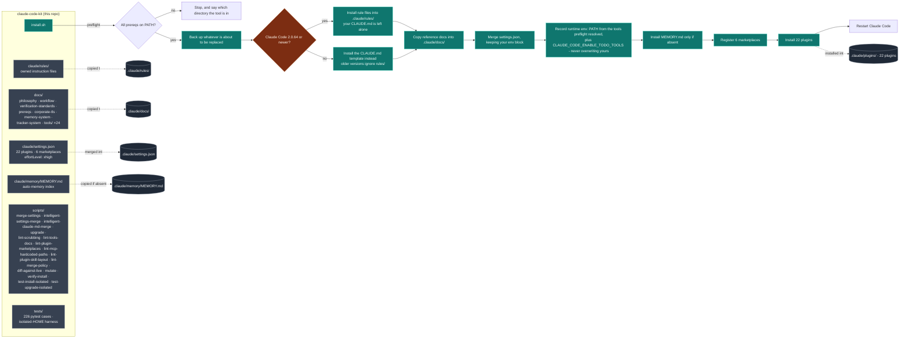
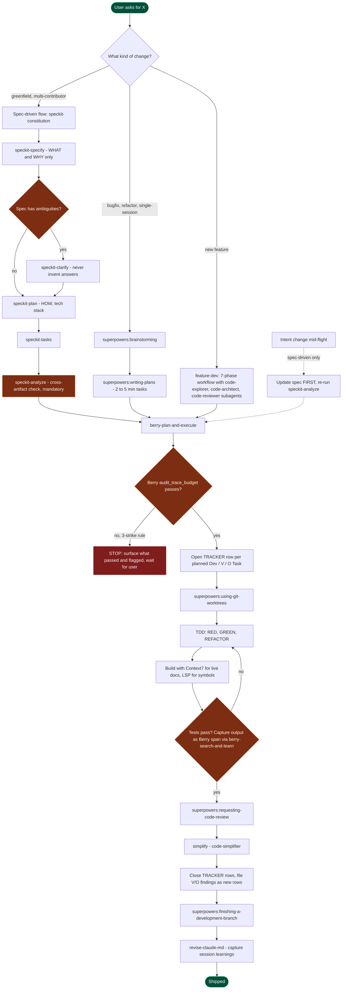
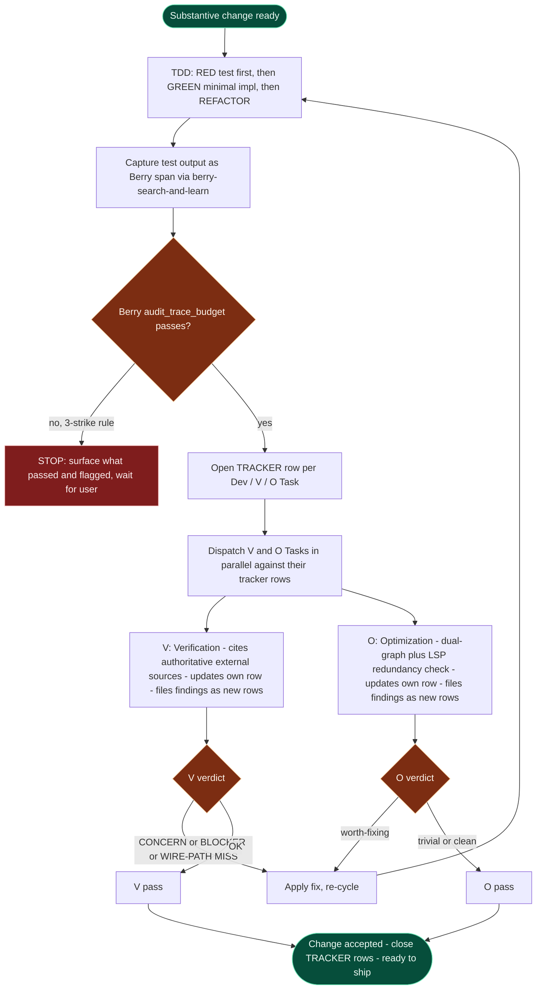

# claude-code-kit

Opinionated bootstrap kit for creating a complete, evidence-first Claude
Code agentic development engineering environment on a clean macOS or Linux machine.

The kit ships three things together so a new machine reaches a working,
high-discipline setup with a single command:

1. **A set of owned rule files** in `~/.claude/rules/`, which Claude Code loads
   every session. They encode the workflow philosophy: TDD-first,
   evidence-before-assertions, a mandatory code-search order, Berry
   verification as a hard gate, spec-driven development as an optional layer.
   Your own `CLAUDE.md` stays yours; the kit does not write it.
2. **A merged `settings.json`** that enables 22 curated plugins from 6
   marketplaces and sets `effortLevel: xhigh` — without overwriting your
   existing `env` block.
3. **A complete documentation layer** explaining *why* every plugin, MCP,
   skill, and rule is in the kit, plus the workflow the kit assumes you want
   to adopt.

> This is datastealth's productivity kit. It is
> opinionated by design — adopting it means adopting the workflow, not just
> the file list. If you only want a subset, fork it and trim.

---

## Architecture


```mermaid
flowchart LR
  subgraph repo["claude-code-kit (this repo)"]
    direction TB
    cmd[install.sh]
    tmpl[claude/rules/<br/>owned instruction files]
    sets[claude/settings.json<br/>22 plugins · 6 marketplaces<br/>effortLevel: xhigh]
    mem[claude/memory/MEMORY.md<br/>auto-memory index]
    docs[docs/<br/>philosophy · workflow · verification-standards ·<br/>prereqs · corporate-tls · memory-system ·<br/>tracker-system · tools/ ×24]
    sc[scripts/<br/>merge-settings · intelligent-settings-merge · intelligent-claude-md-merge · upgrade ·<br/>lint-scrubbing · lint-tools-docs · lint-plugin-marketplaces · lint-mcp-hardcoded-paths · lint-plugin-skill-layout · lint-merge-policy ·<br/>diff-against-live · mutate · verify-install ·<br/>test-install-isolated · test-upgrade-isolated]
    tests[tests/<br/>226 pytest cases ·<br/>isolated-HOME harness]
  end

  cmd -->|preflight| pre{All prereqs on PATH?}
  pre -->|no| fail[Stop, and say which directory the tool is in]
  pre -->|yes| backup[Back up whatever is about to be replaced]
  backup --> gate{Claude Code 2.0.64 or newer?}
  gate -->|yes| rules[Install rule files into .claude/rules/<br/>your CLAUDE.md is left alone]
  gate -->|no| legacy[Install the CLAUDE.md template instead<br/>older versions ignore rules/]
  rules --> docscopy[Copy reference docs into .claude/docs/]
  legacy --> docscopy
  docscopy --> merge[Merge settings.json, keeping your env block]
  merge --> renv[Record runtime env: PATH from the tools preflight resolved,<br/>plus CLAUDE_CODE_ENABLE_TODO_TOOLS - never overwriting yours]
  renv --> memi[Install MEMORY.md only if absent]
  memi --> mp[Register 6 marketplaces]
  mp --> pl[Install 22 plugins]
  pl --> ready[Restart Claude Code]

  tmpl -.copied to.-> rulesHome[(.claude/rules/)]
  docs -.copied to.-> docsHome[(.claude/docs/)]
  sets -.merged into.-> settingsHome[(.claude/settings.json)]
  mem -.copied if absent.-> memHome[(.claude/memory/MEMORY.md)]
  pl -.installed into.-> pluginsHome[(.claude/plugins/ - 22 plugins)]

  classDef store fill:#1f2937,stroke:#9ca3af,color:#f3f4f6
  classDef action fill:#0f766e,stroke:#5eead4,color:#f0fdfa
  classDef artifact fill:#374151,stroke:#9ca3af,color:#f3f4f6
  classDef gate fill:#7c2d12,stroke:#fed7aa,color:#fff7ed
  class rulesHome,docsHome,settingsHome,memHome,pluginsHome store
  class cmd,backup,rules,legacy,docscopy,merge,renv,memi,mp,pl action
  class tmpl,sets,mem,docs,sc,tests artifact
  class gate gate
```

`install.sh` is the only entry point. It is idempotent (re-runnable),
reversible (`uninstall.sh` restores from the timestamped backup), and
strictly local — it does not touch anything outside `~/.claude/`.

---

## The agentic development process this kit enforces

Once the kit is installed and Claude Code is restarted, every non-trivial
task routes through the workflow below. Berry verification gates are
mandatory at three points (plan, complete, intent-change); spec-kit is
an optional alternative spec-driven layer for higher-ceremony work.


```mermaid
flowchart TD
  ask([User asks for X]) --> classify{What kind of change?}

  classify -->|new feature| fd[feature-dev: 7-phase workflow with code-explorer, code-architect, code-reviewer subagents]
  classify -->|greenfield, multi-contributor| sdd[Spec-driven flow: speckit-constitution]
  classify -->|bugfix, refactor, single-session| def[superpowers:brainstorming]

  sdd --> sk1[speckit-specify - WHAT and WHY only]
  sk1 --> sk2{Spec has ambiguities?}
  sk2 -->|yes| sk3[speckit-clarify - never invent answers]
  sk2 -->|no| sk4[speckit-plan - HOW, tech stack]
  sk3 --> sk4
  sk4 --> sk5[speckit-tasks]
  sk5 --> sk6[speckit-analyze - cross-artifact check, mandatory]
  sk6 --> bplan[berry-plan-and-execute]

  def --> wp[superpowers:writing-plans - 2 to 5 min tasks]
  wp --> bplan
  fd --> bplan

  bplan --> bgate1{Berry audit_trace_budget passes?}
  bgate1 -->|no, 3-strike rule| stop[STOP: surface what passed and flagged, wait for user]
  bgate1 -->|yes| track[Open TRACKER row per planned Dev / V / O Task]
  track --> worktree[superpowers:using-git-worktrees]
  worktree --> tdd[TDD: RED, GREEN, REFACTOR]
  tdd --> build[Build with Context7 for live docs, LSP for symbols]
  build --> bgate2{Tests pass? Capture output as Berry span via berry-search-and-learn}
  bgate2 -->|no| tdd
  bgate2 -->|yes| review[superpowers:requesting-code-review]
  review --> simplify[simplify - code-simplifier]
  simplify --> trackclose[Close TRACKER rows, file V/O findings as new rows]
  trackclose --> finish[superpowers:finishing-a-development-branch]
  finish --> docupd[revise-claude-md - capture session learnings]
  docupd --> shipped([Shipped])

  intent[Intent change mid-flight] -.spec-driven only.-> updspec[Update spec FIRST, re-run speckit-analyze]
  updspec -.-> bplan

  classDef gate fill:#7c2d12,stroke:#fed7aa,color:#fff7ed
  classDef stop fill:#7f1d1d,stroke:#fecaca,color:#fef2f2
  classDef terminal fill:#064e3b,stroke:#6ee7b7,color:#ecfdf5
  class bgate1,bgate2,sk2,sk6 gate
  class stop stop
  class shipped,ask terminal
```

Three load-bearing rules behind the diagram:

- **Evidence before assertions.** No claim ships without a Berry span citing
  the evidence. Test output is always captured as a span via
  `berry-search-and-learn` before any "tests pass" claim.
- **Update spec FIRST, then implementation.** In spec-driven mode, if the
  user changes their mind mid-flight, the spec gets updated first and
  `/speckit-analyze` re-runs to surface what else needs to change. Never
  silently let the implementation drift from the spec.
- **3-strike rule.** If a Berry audit fails three times on the same claim
  set, STOP and surface the partial results. Do not silently loop.

See `docs/workflow.md` for the full 10-step procedure,
`docs/verification-standards.md` for what the kit accepts as evidence,
`docs/philosophy.md`
for the reasoning, and `claude/rules/` for the exact rules Claude reads
every session.

---

## The MANDATORY Quality Loop (TDD → Berry → V+O)

The workflow diagram above shows *which steps run*. The quality loop
diagram below shows the *unconditional discipline that wraps every
substantive change*, regardless of which workflow framed it. The
kit ships this as `claude/rules/30-kit-quality-loop.md`, so every session
reads it.


```mermaid
flowchart TD
  start([Substantive change ready]) --> tdd[TDD: RED test first, then GREEN minimal impl, then REFACTOR]
  tdd --> capture[Capture test output as Berry span via berry-search-and-learn]
  capture --> bgate{Berry audit_trace_budget passes?}
  bgate -->|no, 3-strike rule| stop[STOP: surface what passed and flagged, wait for user]
  bgate -->|yes| track[Open TRACKER row per Dev / V / O Task]
  track --> vo[Dispatch V and O Tasks in parallel against their tracker rows]
  vo --> v[V: Verification - cites authoritative external sources - updates own row - files findings as new rows]
  vo --> o[O: Optimization - dual-graph plus LSP redundancy check - updates own row - files findings as new rows]
  v --> vv{V verdict}
  o --> ov{O verdict}
  vv -->|CONCERN or BLOCKER or WIRE-PATH MISS| fix[Apply fix, re-cycle]
  vv -->|OK| vpass[V pass]
  ov -->|worth-fixing| fix
  ov -->|trivial or clean| opass[O pass]
  fix --> tdd
  vpass --> done
  opass --> done
  done([Change accepted - close TRACKER rows - ready to ship])

  classDef gate fill:#7c2d12,stroke:#fed7aa,color:#fff7ed
  classDef stop fill:#7f1d1d,stroke:#fecaca,color:#fef2f2
  classDef terminal fill:#064e3b,stroke:#6ee7b7,color:#ecfdf5
  class bgate,vv,ov gate
  class stop stop
  class start,done terminal
```

Three layers, all mandatory:

- **TDD discipline.** Write the failing test first; confirm it fails
  for the right reason (not from missing imports or fixture gaps).
  Implement the minimum that turns it green. REFACTOR only with the
  test green. **Lifecycle tests, not just function-centric ones** —
  for anything stateful (sessions, caches, queues, write paths),
  assert on the full create → use → close → reopen → cleanup cycle.
- **Berry verification.** Every completion claim ("tests pass", "the
  bug is fixed", "the spec is complete") must be backed by a Berry
  span citing the actual evidence. Test output is the canonical
  evidence form: capture it via `berry-search-and-learn` and cite it
  before any "tests pass" assertion. The kit's Berry plugin enforces
  this with `audit_trace_budget` as the gate — see
  [`docs/tools/berry.md`](docs/tools/berry.md).
- **V+O loop.** After any code, doc, or config change with behavioral
  impact, dispatch a **Verification agent** (cites authoritative
  external sources — upstream READMEs, official docs, vendor API
  references; output: `[OK]` / `[CONCERN]` / `[BLOCKER]` plus the
  hot-path `[WIRE-PATH MISS]` finding, which is BLOCKING) and an
  **Optimization agent** (dual-graph + LSP redundancy check plus
  simplification, clarity, and consistency wins; output:
  `[trivial]` / `[worth-considering]` / `[worth-fixing]`) in parallel
  against the same revision. Verdicts of either block "done" —
  `[CONCERN]` / `[BLOCKER]` / `[WIRE-PATH MISS]` requires a
  correctness fix; `[worth-fixing]` requires a follow-up commit
  before the next substantive change.
- **Tracker as substrate.** V and O are dispatched via the `Task`
  tool against rows the coordinator opened in `docs/TRACKER.md` per
  the Pre-Dispatch Protocol (rows opened **before** any agent fires,
  one per planned dispatch). Each agent updates its **own** row state;
  findings surface as **new rows** in the V/O Findings Tracker, never
  as edits to other agents' rows; coordinators do **not** write to
  agents' rows on their behalf. See
  [`docs/tracker-system.md`](docs/tracker-system.md) for the full
  schema and worked examples.

Hard prohibitions: no "tests pass" claim without a Berry span;
no skipping V+O on the grounds that "the change is small" (small
changes are exactly where unaudited drift accumulates); no inventing
answers when V flags a concern; if Berry audits fail three times on
the same claim set, STOP and surface partial results.

The kit's `requesting-code-review`, `code-quality-reviewer`, and
`code-simplifier` plugins implement V- and O-style passes inside
`superpowers:subagent-driven-development`. The V+O loop above sits
**on top** of that, with one explicit difference: V+O verifies
against **external authoritative sources**, not just against the
local spec or the diff.

---

## What you get

| Layer | Contents |
|---|---|
| **Workflow** | Rule files in `~/.claude/rules/` enforcing TDD-first, evidence-before-assertions, the MANDATORY code-search order (`graph_continue` → LSP → Read/Grep — bash grep/find/cat/sed/awk forbidden), Berry as a hard gate, and the optional spec-kit layer with a 9-step agent playbook. |
| **Plugins (22)** | 17 from `anthropics/claude-plugins-official`: superpowers, feature-dev, code-simplifier, context7, claude-md-management, frontend-design, explanatory-output-style, notion, gopls-lsp, typescript-lsp, **jdtls-lsp** (Java), playwright, chrome-devtools-mcp, microsoft-docs, huggingface-skills, security-guidance, remember. 1 from `Optimal-AI/optibot-skill`: optibot (performance review). 1 from `dthanos-datastealth/hallbayes`: berry (evidence verifier; this is a Claude-Code-packaged fork of upstream `leochlon/hallbayes`). 1 from `multica-ai/andrej-karpathy-skills`. 1 from `JuliusBrussee/caveman`: caveman (token-savings terse-output mode). 1 from `dthanos-datastealth/claude-code-kit` (self-published): claude-code-kit (the kit's own upgrade/rollback/status/fix-notion-mcp-port skills — see `docs/upgrading.md`). |
| **Berry verifier** | Defaults to OpenRouter `openai/gpt-4o-mini` (configured via `~/.berry/config.json` + `~/.berry/mcp_env.json`); self-hosted `llama.cpp` remains supported as the offline alternative. |
| **Memory system** | `MEMORY.md` index template at `~/.claude/memory/`, plus `docs/memory-system.md` explaining the 4 memory types (user, feedback, project, reference), the index format, and the 200-line cap. |
| **Tracker discipline** | The kit's quality loop runs on a coupled `Task` tool + `docs/TRACKER.md` substrate: agents claim work, surface findings as new tasks, and update `docs/TRACKER.md` in lockstep so any human reads one file to see full multi-iteration state. `claude/CLAUDE.md` ships the Phase Start Protocol (EnterPlanMode → approval → execute), Pre-Dispatch Protocol (coordinator creates Dev + V + O tasks upfront), Verification Agent Protocol (steps A–G including hot-path `[WIRE-PATH MISS]` check), and Optimization Agent Protocol (dual-graph + LSP redundancy check, plus the redundant-WORK hunt that catches a step re-running an expensive call an earlier step already made). `docs/tracker-system.md` is the full schema + examples. |
| **Per-tool rationale** | 24 markdown files under `docs/tools/` (one per plugin / MCP / skill / external dependency) following a strict 5-section schema enforced by `scripts/lint-tools-docs.py`. |
| **Settings** | `effortLevel: xhigh` merged in; your existing `env` block (including any corporate-CA bundle vars) preserved byte-for-byte. |

---

## Quick install

```bash
gh repo clone dthanos-datastealth/claude-code-kit
cd claude-code-kit
./install.sh
```

Then restart Claude Code. Verify with `claude plugin list` — you should
see all 22 plugins.

For corporate networks with TLS interception, see
[`docs/corporate-tls.md`](docs/corporate-tls.md) before running install.

---

## Upgrading from a prior install

`install.sh` is safe for fresh installs but its default merge logic
REPLACES `enabledPlugins`, `extraKnownMarketplaces`, and `effortLevel`
keys — running it against a live `~/.claude/` with custom plugins or
marketplaces would destroy that state.

For upgrades on an existing install, use the kit's upgrade tooling:

```bash
# In an active Claude Code session:
/claude-code-kit:upgrade          # interactive: dry-run + prompt + apply

# Or directly from the kit checkout:
bash scripts/upgrade.sh --dry-run # preview the diff
bash scripts/upgrade.sh --apply   # backup + merge + write
bash scripts/upgrade.sh --status  # report drift + unresolved conflicts
```

The upgrade tool:
- Preserves user-added plugins, marketplaces, and env vars (UNION
  merge, user-wins-on-conflict, per
  [`scripts/merge-policy.json`](scripts/merge-policy.json))
- Replaces the kit's own files in `~/.claude/rules/` wholesale, and never
  touches `~/.claude/rules/00-user-overrides.md` after seeding it once
- Moves the kit's sections out of an existing `CLAUDE.md` on the first upgrade,
  leaving your own sections in place
- Falls back to the old heading-based `CLAUDE.md` merge below Claude Code
  2.0.64, where `~/.claude/rules/` is ignored
- Writes timestamped backups before any change; rollback via
  `/claude-code-kit:rollback` or restore manually from
  `~/.claude/backups/`

Full guide: [`docs/upgrading.md`](docs/upgrading.md).

For Notion MCP enterprise allow-list issues (workspace requires
admin-approved redirect URIs — see
[`docs/notion-mcp-pinning.md`](docs/notion-mcp-pinning.md)):

```bash
/claude-code-kit:fix-notion-mcp-port
```

---

## Prereqs

Required on `$PATH` before `install.sh` will run. If you install one of these
in a separate shell — a `curl ... | sh` installer writing to `~/.local/bin`
exports `PATH` for its own process only — re-export it before running the
installer, or start a new login shell; see
[`docs/prereqs.md`](docs/prereqs.md#installing-prerequisites-and-running-installsh-in-separate-shells).

| Tool | Why |
|---|---|
| `claude` | Claude Code CLI |
| `git` | Source control |
| `gh` | GitHub auth (must be `gh auth login`-ed) |
| `python3` ≥ 3.11 | Used by `merge-settings.py`, the lint scripts and tests. On macOS the Homebrew formula does **not** link `python3` — see [`docs/prereqs.md`](docs/prereqs.md) §4 |
| `uv` | Tool installer for `specify` (spec-kit) and Berry's MCP launcher |
| `node` + `npx` | Four enabled plugins need them at runtime: caveman's per-prompt hook runs `node`, and playwright / chrome-devtools / context7 launch via `npx` |

Preflight checks all seven, and checks the Python *version* rather than just
its presence — a 3.9 interpreter used to pass here and then quietly disable
the `security-guidance` plugin's cross-file reviewer several steps later.

The installer **does not** install these for you — see
[`docs/prereqs.md`](docs/prereqs.md) for install commands per OS plus
optional tools (LSP binaries, `ripgrep`, `jq`, `shellcheck`, `specify`).

---

## What install.sh does (and does not do)

**Does, in order, idempotently:**

1. Checks that the tools it needs are on your `$PATH`, and stops with a fix if
   any are missing. If a tool is installed but not on `PATH`, it tells you
   which directory it found it in and the `export` line that sorts it out.
2. Backs up anything it is about to replace, into
   `~/.claude/backups/<ISO-timestamp>/`.
3. Installs the kit's rule files into `~/.claude/rules/`. Your own
   `~/.claude/CLAUDE.md` is left alone. On a Claude Code older than 2.0.64,
   which ignores that directory, it installs `claude/CLAUDE.md` instead and
   says so.
4. Copies the reference docs into `~/.claude/docs/`.
5. Merges `claude/settings.json` into your `~/.claude/settings.json`. Your
   `env` block, your own plugins and your own marketplaces all survive; the
   kit adds what is missing. The one exception is a marketplace the kit itself
   ships, which it reclaims so a release channel can move. See
   [`docs/upgrading.md`](docs/upgrading.md) for the full table.
6. Records the runtime environment in `settings.json`'s `env` block: a `PATH`
   composed from the directories preflight just resolved plus the one the
   install ran under, and `CLAUDE_CODE_ENABLE_TODO_TOOLS=1`. Anything you
   have already set is left alone. This is what makes plugin hooks and MCP
   servers independent of which shell started Claude Code — they inherit its
   process environment, never your profile.
7. Installs `claude/memory/MEMORY.md` only if you do not already have one.
8. Registers the six plugin marketplaces, retrying once on a network blip.
9. Installs all 22 plugins, retrying once each.
10. Writes `~/.claude/.kit-version` and appends an install event to
    `~/.claude/.kit-version.history.jsonl`.
11. Prints next steps.

**Does NOT:**

- Install `uv`, `gh`, `node`, `ripgrep`, `jq`, LSP server binaries (`gopls`,
  `typescript-language-server`, `jdtls`), MCP backend binaries, the
  `specify` CLI, or the Berry verifier backend.
- Modify your shell rc files (`.zshrc`, `.bashrc`). It records a PATH in
  `settings.json` instead, which reaches Claude Code's own subprocesses
  without touching your shell.
- Write your `~/.claude/CLAUDE.md`, on any Claude Code from 2.0.64 onward.
- Write anywhere outside `~/.claude/`, apart from the npm cache it warms so
  the npx-based MCP servers do not cold-start on your first session.

---

## Corporate TLS handling (the kit's one env default)

If your laptop sits behind a corporate TLS-intercepting proxy
(Zscaler, Netskope, Palo Alto Prisma, Cisco Umbrella, etc.), some
of the kit's plugins fail to start out of the box because they fetch
upstream dependencies that get TLS-rejected by the bundled cert
stores in `uvx` / Node / Python `requests`. The most visible
example is the Berry plugin: `uvx` tries to download `openai` from
PyPI to satisfy Berry's dependencies, the corporate proxy presents
its own cert, `uvx`'s bundled rustls trust store doesn't have the
corporate CA, and the plugin shows up as `✘ failed` in `claude mcp list`.

The kit handles this by shipping **two env defaults** that do the same job
for different `uv` versions:

```jsonc
// claude/settings.json
{
  "env": {
    "UV_SYSTEM_CERTS": "1",   // current name
    "UV_NATIVE_TLS": "1"      // deprecated alias, kept for older uv
  }
}
```

Both tell `uvx` to use the operating system's native TLS stack instead of
its bundled rustls certs. On macOS that's the Keychain; on Linux the system
CA bundle (`/etc/ssl/certs/...`). **If your corporate cert is installed in
the system trust store** — the standard way corporate IT distributes it —
`uvx` will trust it through these alone, no per-machine path needed.

`uv` now warns that `UV_NATIVE_TLS` "is deprecated and will be removed in a
future release. Use `UV_SYSTEM_CERTS` instead." The kit ships both so that
machines on an older `uv`, which does not recognise the new name, keep
working. Drop `UV_NATIVE_TLS` once your fleet is past that point.

**The merge is layered:** when `install.sh` runs, these are added to your
`~/.claude/settings.json` env block **only if you don't already have an
entry for them**. Any env entry you already have always wins, so you can
disable a default by setting it to `"0"` in your own settings.json.

**If the system trust store isn't enough** (e.g. your corporate
cert is only available as a file, not installed in Keychain), see
[`docs/corporate-tls.md`](docs/corporate-tls.md) for the
`SSL_CERT_FILE` / `REQUESTS_CA_BUNDLE` / `NODE_EXTRA_CA_CERTS` /
`GIT_SSL_CAINFO` env vars you set yourself. The kit deliberately
does NOT bake an absolute cert path into any plugin's config (that
would couple the kit to one specific machine's filesystem); supplying
the path is the user's responsibility.

**The kit does NOT:**
- Bake any absolute corporate-CA cert path into a plugin's `.mcp.json`
  (a `scripts/lint-mcp-hardcoded-paths.py` guard runs on every
  `test-install-isolated.sh` to catch regressions).
- Install a corporate CA bundle on your behalf.

---

## Required setup after `install.sh`

`install.sh` only configures Claude Code and installs plugins. The kit's
CLAUDE.md mandates that several **external** tools are present —
without them the discipline the kit enforces is non-functional. These
steps are **required**, not optional. The reason `install.sh` does not
run them itself is supply-chain risk: each foundational tool below has
its own update cadence, signing keys, and security posture, and
bundling them into a config bootstrap is the wrong place to take that
responsibility. See [`docs/philosophy.md`](docs/philosophy.md).

### One-time, on every machine (do these in order, immediately after `install.sh`)

| Step | Why | Command |
|---|---|---|
| **1. Restart Claude Code from a NEW terminal** | New plugins register at session start — but the terminal matters too. `claude` inherits the environment of the shell that launched it, and MCP servers and plugin hooks inherit *that*. Relaunching inside the shell you already had open keeps its old PATH | Close the terminal window, open a new one, run `claude`. Not just `/exit` then `claude` |
| **2. Configure the Berry verifier backend** | Berry verification is a MANDATORY gate; every Berry call fails closed without a reachable LLM backend | `/berry:berry-configure` — walks you through OpenRouter (default — `openai/gpt-4o-mini`) or a self-hosted llama.cpp endpoint. **Then add `BERRY_VERIFIER_MODEL` yourself**: the command does not write the model pin, and an unpinned verifier on OpenRouter resolves to an arbitrary model that probably lacks logprobs. See [`docs/tools/berry.md`](docs/tools/berry.md) |
| **3. Install + register the dual-graph MCP** | The MANDATORY code-search order requires `graph_continue` as the FIRST call for every code lookup; without it the first leg silently no-ops and the kit falls back to the grep its own rules forbid | The reference implementation is `graperoot` on PyPI. Register with **`claude mcp add --scope user`** — without that flag it registers per-project and exists only in the directory you ran it from. [`docs/prereqs.md`](docs/prereqs.md) section 10 owns the recipe, the tool contract any substitute must satisfy, and the supply-chain profile (proprietary, self-updating, telemetry on by default) to read first |
| **4a. Install the Go LSP binary (`gopls`)** | The kit's `gopls-lsp` plugin is an MCP wrapper; it does not auto-install the language server. Without `gopls` on `$PATH`, the Go LSP integration loads but every call falls through | `go install golang.org/x/tools/gopls@latest` (Go must be installed; see [`docs/prereqs.md`](docs/prereqs.md) section 7). The binary lands in `~/go/bin`, which is not on `PATH` by default — add it |
| **4b. Install the TypeScript LSP binaries** | Same reason as 4a — `typescript-lsp` is a plugin wrapper; the actual language server is a separate npm package | `npm install -g typescript-language-server typescript@5`. **Pin the 5.x line.** TypeScript 7 is the native port and ships no `tsserver.js`, so the language server cannot start against it — while `tsc --version` still prints happily. See [`docs/prereqs.md`](docs/prereqs.md) section 8 |
| **4c. Install the Java LSP binary (`jdtls`) + JDK 21+** | Same reason as 4a — `jdtls-lsp` is a plugin wrapper; the underlying Eclipse JDT.LS server requires Java 21+ at runtime | macOS: `brew install openjdk jdtls`, then `export PATH="/opt/homebrew/opt/openjdk/bin:$PATH"` — Homebrew's openjdk is **keg-only**, so without that line `java` still resolves to the macOS stub and reports "Unable to locate a Java Runtime". Linux: OpenJDK 21+ via your package manager plus `jdtls` from the [official release page](https://download.eclipse.org/jdtls/snapshots/?d). See [`docs/prereqs.md`](docs/prereqs.md) section 9 |
| **5. Authenticate the OAuth MCP servers** | `notion` and `huggingface-skills` are HTTP MCP servers that need an interactive OAuth grant. Until then both show `! Needs authentication` and their tools are unavailable | Run `/mcp` in a Claude Code session and complete the flow for each. Enterprise Notion workspaces with member-install allow-listing also need [`/claude-code-kit:fix-notion-mcp-port`](docs/notion-mcp-pinning.md) first |
| **5b. (Optional) Context7 API key** | `context7` works anonymously but is rate-limited; the plugin reads `CONTEXT7_API_KEY` if present | Add `CONTEXT7_API_KEY` to the `env` block of `~/.claude/settings.json` |

### Per project, when starting work on a new repo

| Step | Why | Command |
|---|---|---|
| **6. Initialize spec-kit for the project** | Required when adopting the spec-driven flow for a project; installs `/speckit-*` skills + `.specify/` scaffold into the project | `cd <your-project>` then `specify init --here --integration claude`, then restart Claude Code in that directory. Add `--force` to skip the confirmation prompt, which fires in any non-empty directory |

### Per session (caveman is the only opt-in here)

The caveman plugin is installed automatically by `install.sh` (it ships
as `caveman@caveman` via the `JuliusBrussee/caveman` marketplace). What
*is* per-session is the activation: invoke the plugin's slash command
when output-token volume is the constraint, then it's active for the
rest of that session. All other plugins/skills are session-scope
automatic. See [`docs/tools/caveman.md`](docs/tools/caveman.md) for
mode flags (`lite`, `full`, `ultra`, `wenyan`).

### Verifying everything is wired up

After steps 1–5, run:

```bash
claude plugin list                            # 22 plugins enabled
claude mcp list                               # every server ✓ Connected or ! Needs authentication

which gopls typescript-language-server jdtls  # all three resolve (gopls needs ~/go/bin on PATH)
java -version                                 # a real version, not "Unable to locate a Java Runtime"
ls "$(npm root -g)/typescript/lib/tsserver.js"  # must exist — tsc --version does NOT prove this
node --version && npx --version               # caveman's hook and three MCP servers need these
```

Each of those checks the thing that actually breaks. Two that look
equivalent but are not: `tsc --version` succeeds on TypeScript 7 where the
LSP is completely dead, and `jdtls --help` exits 0 with no JVM installed at
all — neither can fail in the way that matters, so neither is listed.

Then in a fresh Claude Code session, invoke `/berry:berry-configure` and
confirm it reports the backend as reachable. If any of the above fails, see
[`docs/prereqs.md`](docs/prereqs.md) for the section-by-section install
commands.

**If `claude mcp list` and your session disagree**, believe neither on its
own. `claude mcp list` spawns a fresh process and reports the server's real
health; your running session caches a failed connection for about 15
minutes and will keep refusing the tools regardless. After fixing a PATH or
a registration, start a new session.

### If npx-based MCPs show ✘ failed on first launch, restart once

`install.sh` pre-warms the npm cache for the three npx-based MCP
servers (`@playwright/mcp`, `chrome-devtools-mcp`,
`@upstash/context7-mcp`) so that first launch reads from cache
instead of resolving from the registry. Even so, on a cold install
the first Claude Code session can race the MCP handshake timeout
while `npx` is finalizing its resolve, and one or more of those three
MCPs will get marked `✘ failed` in that session. Claude Code does
**not** auto-retry an MCP once it's marked failed — the only recovery
is a session restart. Quit (`Cmd-Q` or `/exit`) and relaunch
`claude`; the cache is warm by then and all three will come up
`✓ Connected`. If a restart doesn't fix it, then it's a real
failure — check `claude mcp list` for the actual error.

---

## Reverting

```bash
./uninstall.sh
```

Restores `~/.claude/CLAUDE.md` and `~/.claude/settings.json` from the most
recent timestamped backup under `~/.claude/backups/`. Idempotent — safe to
re-run. Plugins remain installed (use `claude plugin uninstall <name>` if
you also want to remove those).

---

## Drift detection

Once you've adopted the kit, your live `~/.claude/` will inevitably drift
from this repo — you'll add a plugin, tweak a rule, etc. Run:

```bash
./scripts/diff-against-live.sh
```

It diffs the kit's rule files against the ones in `~/.claude/rules/`, skipping
`00-user-overrides.md` because that one is yours and is meant to differ, then
shows a structural delta on `settings.json`: plugins added or removed,
marketplaces added, and env keys that are yours rather than the kit's. On a
Claude Code below 2.0.64 it falls back to comparing `CLAUDE.md`. Exits 0 when
nothing has drifted, 1 when something has — env differences included. Use it
to decide what is worth contributing back.

For "has anything been edited since I installed", use the other one:

```bash
bash scripts/upgrade.sh --status
```

That compares the SHAs recorded at install time against what is on disk and
prints `match` or `DRIFTED` per file, alongside the installed version,
channel, commit, unresolved conflicts and available backups.

---

## Testing the kit in parallel (without clobbering your real `~/.claude/`)

The kit ships an isolation helper that runs `install.sh` against a
temporary `$HOME`, exercises the **real** `claude` CLI (so real plugin
installs happen), and then *proves* your real `~/.claude/` is untouched
by comparing mtimes of `~/.claude/CLAUDE.md` and `~/.claude/settings.json`
before and after.

```bash
# Keep the tempdir for inspection (default)
./scripts/test-install-isolated.sh

# Or auto-clean on success
./scripts/test-install-isolated.sh --clean
```

**For the upgrade path** (testing `scripts/upgrade.sh` against a HOME
that already has `~/.claude/.kit-version` + simulated user mutations),
use the sibling script:

```bash
./scripts/test-upgrade-isolated.sh         # install → mutate → upgrade → assert preservation + leak check
./scripts/test-upgrade-isolated.sh --clean # auto-clean on success
```

Both are local-only (CI doesn't have the real `claude` CLI, so neither
runs in `.github/workflows/ci.yml` — by design).

**What `test-install-isolated.sh` does:**

1. Captures `mtime` of your real `~/.claude/CLAUDE.md` and `~/.claude/settings.json`.
2. Creates `$(mktemp -d -t cck-test-XXXXXX)` and runs `HOME="$TEST_HOME" ./install.sh`.
3. Asserts every expected artifact landed in the isolated HOME, via
   `scripts/verify-install.py`: `settings.json`, `memory/MEMORY.md`,
   `docs/tools/`, a non-empty plugin set, and — depending on the CLI
   version — either the six kit rule files plus a seeded
   `00-user-overrides.md`, or the `CLAUDE.md` template below the 2.0.64
   floor. It reports *every* missing artifact rather than stopping at the
   first, and it does not require `CLAUDE.md` above the floor, because the
   kit deliberately stopped writing it there.
   Also runs `lint-mcp-hardcoded-paths.py` against the populated
   plugin cache — fails the test if any installed plugin's `.mcp.json`
   contains an owner-specific absolute path (`/Users/<x>`, `/home/<x>`,
   etc.) that would break the plugin on other users' machines.
4. **Leak check** — re-captures the real `~/.claude/CLAUDE.md`,
   `~/.claude/settings.json`, and `~/.claude.json` (MCP server config,
   sibling dot-file) mtimes and exits non-zero if any of the three
   changed. If a future kit change accidentally writes outside the
   isolated HOME, this catches it.
5. Prints a summary and tells you how to poke around the tempdir. An
   `EXIT` trap removes it on success with `--clean`, and keeps it with the
   path printed on failure, so a failed run leaves you something to
   inspect rather than silently abandoning ~1 GB.

The artifact assertions live in a Python script rather than inline in the
harness for a reason worth knowing: as a shell loop over filenames they
could not be tested, and they went stale. The loop still required
`CLAUDE.md` long after the kit stopped writing it, so the harness failed on
every run against a current CLI — and failed at step 3, which meant the
leak check in step 4 never executed at all. `tests/test_verify_install.py`
now covers the assertions directly.

**What it can't isolate** (these are global by design and the kit doesn't
clone them either): the `claude` CLI binary itself, LSP server binaries
(`gopls`, `tsserver`, `jdtls`), and `gh`'s auth token. The test uses
those globals, which is what you want — you're testing the *kit* against
the real toolchain.

Use this any time you've changed `install.sh`, the plugin set, or the
docs-shipping logic and want to confirm the kit installs cleanly without
touching your working setup.

### Launching `claude` interactively in the isolated HOME

The leak-check test above runs `claude mcp list` non-interactively and
doesn't need an authenticated session. If you want to actually *use*
Claude Code interactively inside the isolated HOME (e.g. to verify a
new plugin loads correctly, to walk through a slash-command flow),
**do not run `/login` from the isolated HOME**. Claude Code's OAuth
credentials live in the macOS Keychain (or Linux Secret Service), and
the lookup is HOME-dependent. Re-running `/login` from a fresh `$HOME`
creates a new
Keychain item that races against the existing one, triggering a
Keychain authorization prompt and (often) a post-OAuth handshake
failure that can leave both the test session AND the real session in
a broken state.

The right pattern is to use a **long-lived OAuth token** generated
from your existing subscription session, passed to the isolated
session as an env var. This bypasses Keychain lookup entirely, works
on any `$HOME`, and is the canonical pattern for non-interactive
Claude Code use (CI, automation, isolated test sessions) per upstream.

**Step 1. Generate the token (one-time, from your real shell):**

```bash
claude setup-token
```

This opens your browser, walks through OAuth against your existing
subscription, and prints a token of the form `sk-ant-oat01-...`.
**The token is a bearer credential — anyone with it has full API
access for one year.** Do not paste it into a chat transcript,
commit it, or echo it back through your terminal history.

**Step 2. Set the env var without leaking the token (read silently):**

```bash
read -s CLAUDE_CODE_OAUTH_TOKEN     # silent prompt; paste then Enter
export CLAUDE_CODE_OAUTH_TOKEN      # make it available to subprocesses
```

`read -s` reads from stdin without echoing — the token never appears
in your terminal scrollback or shell history.

**Step 3. Verify the env var is recognized (before the interactive
launch, since that's blocking):**

```bash
HOME="$TEST_HOME" claude auth status
# Expected: {"loggedIn": true, "authMethod": "oauth_token", ...}
```

If `loggedIn: false` here, fix the env var before launching; the
interactive session will fail every API call with 401 otherwise.

**Step 4. Launch the isolated session:**

```bash
HOME="$TEST_HOME" claude
```

**If the token leaks (pasted into a transcript, committed, etc.),
rotate immediately:**

```bash
claude auth logout                  # invalidates the token globally
# Then generate a new one with `claude setup-token` and re-export it.
```

You can also revoke the token from the Anthropic console at
[`console.anthropic.com`](https://console.anthropic.com/) under
Settings → API Keys / OAuth Tokens.

**Why not `cp ~/.claude.json $TEST_HOME/.claude.json`?** Earlier
versions of this guide suggested that. Empirically: the copy
populates the welcome banner and account metadata, but every API
call 401s and `claude auth status` reports `loggedIn: false`. The
env-var path above is the only verified-working approach.

---

## Layout

```
claude-code-kit/
├── README.md                          (this file)
├── LICENSE                            MIT
├── CHANGELOG.md                       Keep a Changelog format
├── CONTRIBUTING.md                    PR workflow
├── install.sh                         Bootstrap entry point
├── uninstall.sh                       Restore from latest backup
├── pyproject.toml                     pytest config
├── .github/workflows/ci.yml           shellcheck + lints + 226 pytest cases
├── claude/                            Files copied/merged into ~/.claude/
│   ├── CLAUDE.md                      Scrubbed opinionated template (legacy merge path)
│   ├── rules/                         Kit instructions, owned; copied to ~/.claude/rules/
│   ├── settings.json                  22 plugins, 6 marketplaces, effortLevel: xhigh
│   └── memory/MEMORY.md               Empty index with type sections
├── docs/
│   ├── philosophy.md                  Why each rule exists
│   ├── workflow.md                    The 10-step development loop
│   ├── verification-standards.md      What counts as evidence, and why
│   ├── prereqs.md                     Install steps per OS
│   ├── corporate-tls.md               CA bundle setup for intercepted networks
│   ├── memory-system.md               Auto-memory schema and conventions
│   ├── tracker-system.md              docs/TRACKER.md schema + agent dispatch + V/O protocols
│   └── tools/                         24 per-tool rationale docs (5-section schema)
│       ├── superpowers.md             Workflow-discipline skills
│       ├── berry.md                   Evidence verifier (OpenRouter default)
│       ├── feature-dev.md             7-phase feature workflow
│       ├── dual-graph-mcp.md          Code-navigation MCP (external prereq)
│       ├── spec-kit.md                Spec-driven development CLI (optional)
│       ├── jdtls-lsp.md               Java language server
│       ├── lsp-gopls.md               Go language server
│       ├── lsp-typescript.md          TypeScript language server
│       ├── playwright-mcp.md          Browser automation
│       ├── chrome-devtools-mcp.md     CDP-level introspection
│       ├── context7.md                Live library documentation
│       ├── microsoft-docs.md          Microsoft Learn search
│       ├── notion.md                  Workspace + task tracker
│       ├── huggingface-skills.md      HF Hub workflows
│       ├── frontend-design.md         Distinctive UI generation
│       ├── code-simplifier.md         Post-implementation cleanup
│       ├── claude-md-management.md    CLAUDE.md auditing
│       ├── security-guidance.md       OWASP-aware code review
│       ├── optibot.md                 Performance-focused review
│       ├── remember.md                Session-state checkpointing
│       ├── andrej-karpathy-skills.md  LLM coding heuristics
│       ├── caveman.md                 Terse-output token-savings skill
│       └── explanatory-output-style.md Insight blocks after code
├── scripts/
│   ├── merge-settings.py              Atomic settings.json merge
│   ├── diff-against-live.sh           Drift detector
│   ├── diff-settings.py               Settings delta (JSON)
│   ├── lint-scrubbing.py              Catches owner paths / company names
│   ├── lint-tools-docs.py             Enforces 5-section schema
│   ├── lint-plugin-marketplaces.py    Verifies every plugin resolves against its upstream marketplace.json
│   ├── lint-mcp-hardcoded-paths.py    Scans installed plugins' .mcp.json for owner-specific paths
│   ├── lint-plugin-skill-layout.py    Catches skills at paths Claude Code never discovers
│   ├── mutate.py                      Break the code on purpose; require the tests to notice
│   ├── mutants.json                   The catalogue: one entry per defect, and the tests that must catch it
│   ├── verify-install.py              Artifact assertions for the isolation harness
│   └── test-install-isolated.sh       Parallel-test install.sh in a temp HOME with leak check + post-install lints
└── tests/                             pytest with isolated-HOME harness
```

---

## Further reading

- [`docs/philosophy.md`](docs/philosophy.md) — the "why" behind every rule
- [`docs/workflow.md`](docs/workflow.md) — the 10-step development loop
- [`docs/tracker-system.md`](docs/tracker-system.md) — TRACKER.md schema + Pre-Dispatch Protocol + V/O agent protocols
- [`docs/corporate-tls.md`](docs/corporate-tls.md) — corporate TLS-intercepting proxy setup + `UV_NATIVE_TLS=1` default
- [`docs/tools/`](docs/tools/) — one rationale doc per tool
- [`CHANGELOG.md`](CHANGELOG.md) — change history
- [`CONTRIBUTING.md`](CONTRIBUTING.md) — PR workflow

## License

MIT — see [`LICENSE`](LICENSE).
